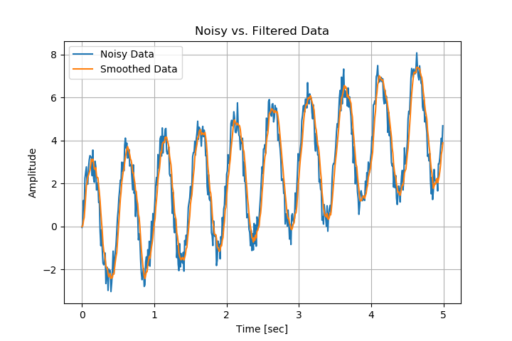

# MedianFilterCpp

A simple median filter library for smoothing noisy data, written in C++. An example is also given.

**Author:** Michael Wrona | *B.S. Aerospace Engineering*

## HOW TO USE

The median filter class and functions are within `MedianFilter.cpp` and `MedianFiter.h`. An example of how to use the class and functions can be found in `main.cpp`. This code also utilizes the [matplotlibcpp](https://github.com/lava/matplotlib-cpp) plotting library to plot the data. The plot is output as a PNG image.




To initialize the median filter, a MedianFilter class must be created, and a window length must be specified. Then, the 'Update' attribute can be called to add a new noisy data point and return the filtered value.

```cpp
MedianFilter MedianFilt(windowSize);

while (recording data) {
    ...
    smoothedReading = MedianFilt.Update(reading);
    ...
}
```

## HOW TO COMPILE

For your convenience, a makefile is included to compile the example code. To compile and run the program using the makefile, run the command:

```
$ make run
```

If you desire to manually compile it from the command line, use the following commands:

```
$ g++ -std=c++11 -c MedianFilter.cpp
$ g++ main.cpp MedianFilter.o -std=c++11 -I/usr/include/python2.7 -lpython2.7 -o medianFiltExample
$ ./medianFiltExample
```
